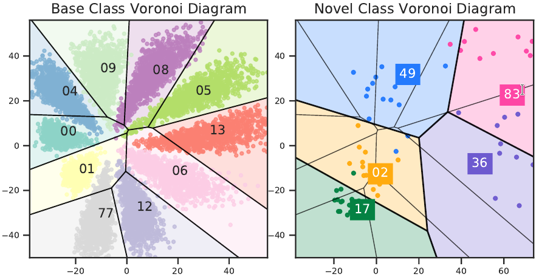
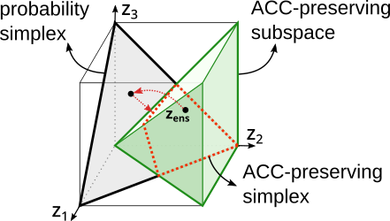
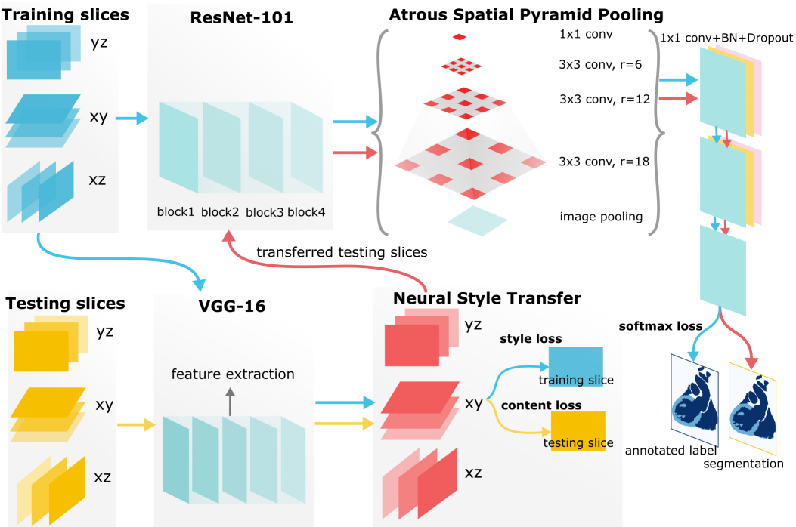
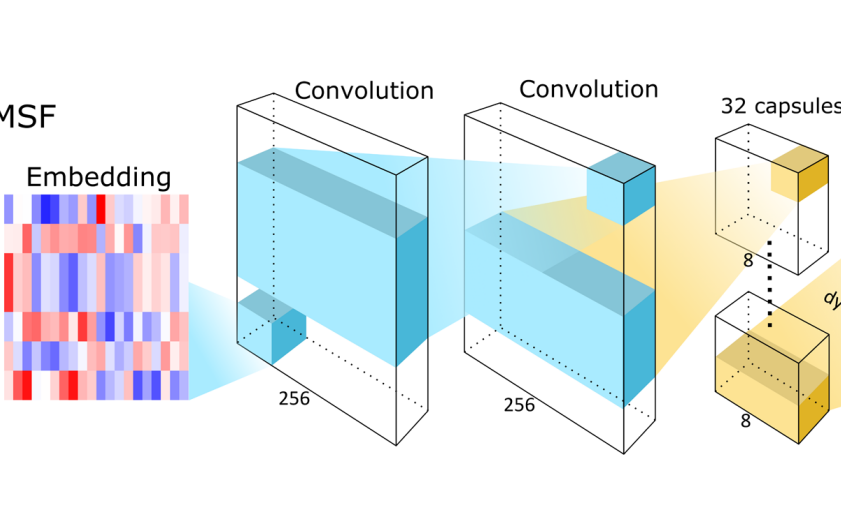
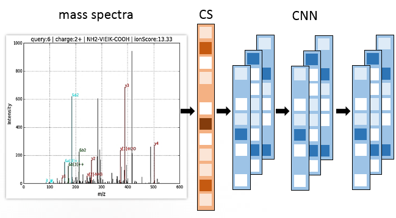
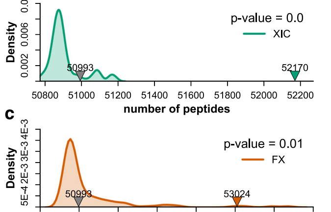

## About Me

I am currently a Ph.D. candidate in [Department of Computer Science and Engineering](https://engineering.buffalo.edu/computer-science-engineering.html) at [University at Buffalo, SUNY](https://www.buffalo.edu/), advised by [Prof. Dr. Mingchen Gao](https://cse.buffalo.edu/~mgao8/) and [Prof. Dr. Jinhui Xu](https://cse.buffalo.edu/~jinhui/).

## Research Interests

My research interest is **deep learning** powered by (high dimensional) **computational geometry**.

<!--
<strong style="color:#e74d3c; font-weight:600">I am looking for a research intern position in the EU and the US. I'd appreciate a ping if you see a job I might fit.</strong>
-->

## News

- **[Jan. 20, 2022]** Our paper about [few-shot learning](https://openreview.net/forum?id=6kCiVaoQdx9) is accepted to [ICLR 2022](https://iclr.cc/Conferences/2022).
- **[May. 12, 2021]** Our paper about [uncertainty calibration](https://proceedings.mlr.press/v161/ma21a.html) is accepted to [UAI 2021](https://www.auai.org/uai2021/accepted_papers).

<h2 id="publications" style="margin: 2px 0px -15px;">Selected Publications <temp style="font-size:15px;">[</temp><a href="https://scholar.google.com/citations?user=4NOrXN8AAAAJ&hl=en" target="_blank" style="font-size:15px;">Full List</a><temp style="font-size:15px;">]</temp><temp style="font-size:15px;">[</temp><a href="https://dblp.org/pid/195/7742.html" target="_blank" style="font-size:15px;">DBLP</a><temp style="font-size:15px;">]</temp></h2>

<ol class="bibliography">
<li>

  

    
            <abbr class="badge">ICLR</abbr>
  

  

      
<a href="https://openreview.net/forum?id=6kCiVaoQdx9">Few-shot Learning as Cluster-induced Voronoi Diagrams: A Geometric Approach</a>

      
<strong>Chunwei Ma</strong>, Ziyun Huang, Mingchen Gao, Jinhui Xu

      
<em>International Conference on Learning Representations <strong>(ICLR)</strong>, 2022.</em>
      

    

      <a href="https://arxiv.org/pdf/2202.02471" class="btn btn-sm z-depth-0" role="button" target="_blank" style="font-size:12px;">PDF</a>
      <a href="https://github.com/horsepurve/DeepVoro" class="btn btn-sm z-depth-0" role="button" target="_blank" style="font-size:12px;">Code</a>
      <a href="./assets/bib/iclr22.txt" class="btn btn-sm z-depth-0" role="button" target="_blank" style="font-size:12px;">BibTex</a>
    

  

</li>

 

<li>

  

    
            <abbr class="badge">UAI</abbr>
  

  

      
<a href="https://proceedings.mlr.press/v161/ma21a.html">
Improving Uncertainty Calibration of Deep Neural Networks via Truth Discovery and Geometric Optimization</a>

      
<strong>Chunwei Ma</strong>, Ziyun Huang, Jiayi Xian, Mingchen Gao, Jinhui Xu

      
<em>Uncertainty in Artificial Intelligence <strong>(UAI)</strong>, 2021.</em>
      

    

      <a href="https://arxiv.org/abs/2106.14662" class="btn btn-sm z-depth-0" role="button" target="_blank" style="font-size:12px;">PDF</a>
      <a href="https://github.com/horsepurve/truly-uncertain" class="btn btn-sm z-depth-0" role="button" target="_blank" style="font-size:12px;">Code</a>
      <a href="./assets/bib/uai21.txt" class="btn btn-sm z-depth-0" role="button" target="_blank" style="font-size:12px;">BibTex</a>
       
      <strong><small style="color:#8d5ba6">The first work that brought truth discovery into deep learning.</small></strong>
    

  

</li>

 

<li>

  

    
            <abbr class="badge">MICCAI</abbr>
  

  

      
<a href="https://link.springer.com/chapter/10.1007/978-3-030-32245-8_15">Neural Style Transfer Improves 3D Cardiovascular MR Image Segmentation on Inconsistent Data</a>

      
<strong>Chunwei Ma</strong>, Zhanghexuan Ji, Mingchen Gao

      
<em>International Conference on Medical Image Computing and Computer-Assisted Intervention <strong>(MICCAI)</strong>, 2019.</em> <strong><i style="color:#59d47c">Early Accept</i></strong>
      

    

      <a href="https://arxiv.org/pdf/1909.09716" class="btn btn-sm z-depth-0" role="button" target="_blank" style="font-size:12px;">PDF</a>
      <a href="https://link.springer.com/chapter/10.1007/978-3-030-32245-8_15" class="btn btn-sm z-depth-0" role="button" target="_blank" style="font-size:12px;">DOI</a>
      <a href="https://github.com/horsepurve/StyleSegor" class="btn btn-sm z-depth-0" role="button" target="_blank" style="font-size:12px;">Code</a>
      <a href="./assets/bib/miccai19.txt" class="btn btn-sm z-depth-0" role="button" target="_blank" style="font-size:12px;">BibTex</a>
    

  

</li>

 

<li>

  

    
            <abbr class="badge">ACS AC</abbr>
  

  

      
<a href="https://pubs.acs.org/doi/abs/10.1021/acs.analchem.8b02386">Improved Peptide Retention Time Prediction in Liquid Chromatography through Deep Learning</a>

      
<strong>Chunwei Ma</strong> <i>et al.</i>

      
<em>Analytical chemistry, 2018.</em> Impact Factor: <strong><i style="color:#e74d3c">6.350</i></strong>
      

    

      <a href="https://pubs.acs.org/doi/abs/10.1021/acs.analchem.8b02386" class="btn btn-sm z-depth-0" role="button" target="_blank" style="font-size:12px;">DOI</a>
      <a href="https://github.com/horsepurve/DeepRTplus" class="btn btn-sm z-depth-0" role="button" target="_blank" style="font-size:12px;">Code</a>
      <a href="./assets/bib/ac18.txt" class="btn btn-sm z-depth-0" role="button" target="_blank" style="font-size:12px;">BibTex</a>
       
      <strong><small style="color:#8d5ba6">The first work that brought deep transfer learning into LCMS analysis.</small></strong>
    

  

</li>

 

<li>

  

    
            <abbr class="badge">arXiv</abbr>
  

  

      
<a href="https://github.com/horsepurve/DeepQuality">DeepQuality: Mass Spectra Quality Assessment via Compressed Sensing and Deep Learning</a>

      
<strong>Chunwei Ma</strong>

      
<em>Preprint, 2017.</em>
      

    

      <a href="https://arxiv.org/pdf/1710.11430" class="btn btn-sm z-depth-0" role="button" target="_blank" style="font-size:12px;">PDF</a>
      <a href="https://github.com/horsepurve/DeepQuality" class="btn btn-sm z-depth-0" role="button" target="_blank" style="font-size:12px;">Code</a>
      <a href="./assets/bib/deepquality.txt" class="btn btn-sm z-depth-0" role="button" target="_blank" style="font-size:12px;">BibTex</a>
    

  

</li>

 

<li>

  

    
            <abbr class="badge">BMC</abbr>
  

  

      
<a href="https://link.springer.com/article/10.1186/s12859-017-1491-5">
Improvement of peptide identification with considering the abundance of mRNA and peptide</a>

      
<strong>Chunwei Ma</strong> <i>et al.</i>

      
<em>BMC bioinformatics, 2017.</em> Impact Factor: <strong><i style="color:#e74d3c">2.213</i></strong>
      

    

      <a href="https://link.springer.com/content/pdf/10.1186/s12859-017-1491-5.pdf" class="btn btn-sm z-depth-0" role="button" target="_blank" style="font-size:12px;">PDF</a>
      <a href="https://link.springer.com/article/10.1186/s12859-017-1491-5" class="btn btn-sm z-depth-0" role="button" target="_blank" style="font-size:12px;">DOI</a>
      <a href="./assets/bib/bmc17.txt" class="btn btn-sm z-depth-0" role="button" target="_blank" style="font-size:12px;">BibTex</a>
    

  

</li>

 

</ol>

## Teaching

- Teaching Assistant, [Blockchain Application Development](https://cse.buffalo.edu/~bina/cse426/fall2021/index.html) at [University at Buffalo](https://www.buffalo.edu/), 2019-2021
- Teaching Assistant, Data-intensive Computing at [University at Buffalo](https://www.buffalo.edu/), 2019

## Services

<h4 style="margin:0 10px 0;">Conference Review</h4>

<ul style="margin:0 0 5px;">
  <li><a href="https://neurips.cc/Conferences/2021"><autocolor>Annual Conference on Neural Information Processing Systems (NeurIPS), 2020-2021</autocolor></a></li>
  <li><a href="https://icml.cc/Conferences/2022"><autocolor>International Conference on Machine Learning (ICML), 2021-2022</autocolor></a></li>
  <li><a href="https://iclr.cc/Conferences/2022"><autocolor>International Conference on Learning Representations (ICLR), 2022-2022</autocolor></a></li>
  <li><a><autocolor>International Conference on Medical Image Computing and Computer Assisted Intervention (MICCAI), 2019-2022</autocolor></a></li>
  <li><a><autocolor>European Conference on Machine Learning and Principles and Practice of Knowledge Discovery in Databases (ECML-PKDD), 2020</autocolor></a></li>
  <li><a><autocolor>International Workshop on Combinatorial Image Analysis (IWCIA), 2020</autocolor></a></li>
  <!--
  <li><a href="https://mmasia2021.uqcloud.net/"><autocolor>ACM MM Asia 2020-2021</autocolor></a></li>
  <li><a href="http://www.acml-conf.org/2021/"><autocolor>ACML 2021</autocolor></a></li>
  -->
</ul>

<h4 style="margin:0 10px 0;">Journal Review</h4>

<ul style="margin:0 0 5px;">
  <li><a><autocolor>IEEE TNNLS, 2022</autocolor></a></li>
</ul>

## Contact
**Address:** [338X Davis Hall, Buffalo, NY, 14260](https://engineering.buffalo.edu/computer-science-engineering.html)
 
**Phone:** (716)-256-9951 &nbsp;&nbsp;&nbsp;&nbsp;&nbsp;&nbsp; **WeChat:** horsepurve
